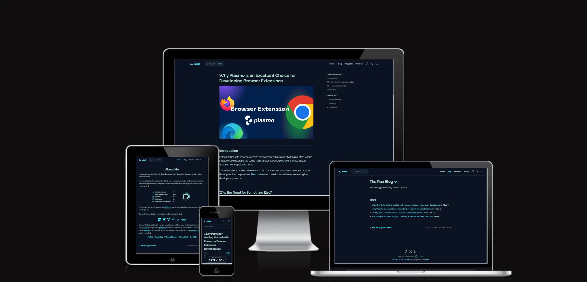

    
	
Personal blog based on <a href="https://vitepress.dev/" target="_blank">VitePress</a> default theme extension.

## Features

- Dark mode only
- Comments([Giscus](https://giscus.app/))
- Local Search
- Google Analytics support
- Reading progress bar
- RSS feed

## Contribution

Please make sure to read the [Contributing Guide](https://github.com/aiktb/Rea/blob/main/.github/CONTRIBUTING.md) before making a pull request.

## License

The code uses the [MIT](https://github.com/aiktb/Rea/blob/main/LICENSE-CODE) license, and the blog post uses the [CC BY 4.0](https://github.com/aiktb/Rea/blob/main/LICENSE-POST) license.

## Preview

